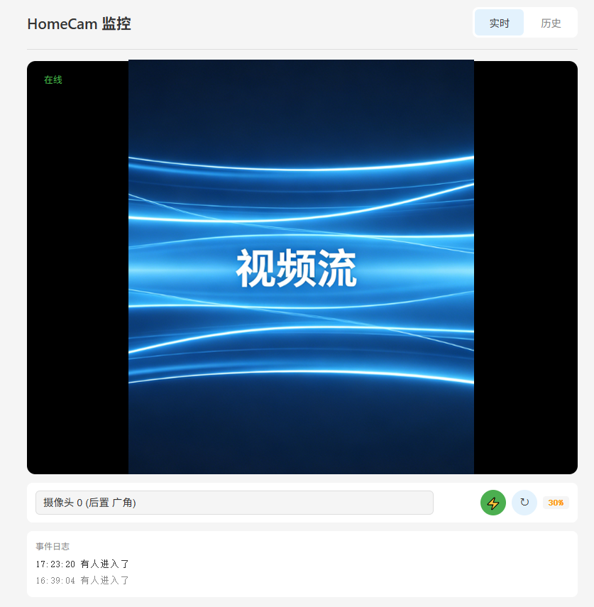
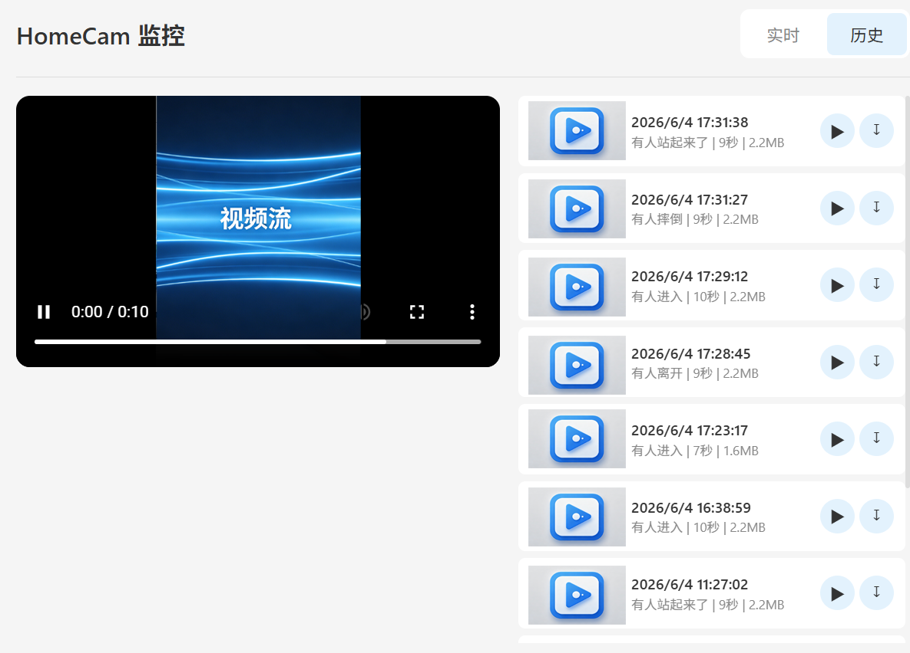

# HomeCam - 闲置 Android 手机变身局域网监控摄像头

[](https://developer.android.com/about/versions/oreo) [](https://developer.android.com/about/versions/14) [](https://kotlinlang.org/) [](LICENSE)

HomeCam 是一款将闲置 Android 手机转化为局域网监控摄像头的应用。它利用 Camera2 采集视频，通过 MJPEG/RTSP 实时推流，并内置 AI 事件检测（人物移动/跌倒/玩手机/哭声/睡眠检测），支持事件触发自动录像回放。 

可以通过WEB端进行视频流查看，或通过配套的软件Homecam-TE实现多台摄像头的视频流组播查看。

软件说明书见 [用户使用手册](docs/user_manual.html)。

## 功能特性

- **实时视频流** — 通过 MJPEG over HTTP 在局域网内任意浏览器中查看实时画面
- **多摄像头支持** — 运行时切换前后置/外接摄像头，支持 MIUI 等系统的逻辑多摄组（超广角/长焦），无需重启服务
- **息屏后台运行** — 前台服务 + WakeLock，锁屏后持续采集和推流
- **AI 事件检测**
  - **人物移动检测** — 基于 MediaPipe EfficientDet-Lite0，通过进出状态机判断人物/动物进入和离开
  - 进出状态机：无人状态下检测到人/动物触发“进入”事件，持续 30 秒未检测到触发“离开”事件
  - 识别标签：person / cat / dog / bird
  - **婴儿哭声识别** — 基于 TensorFlow Lite YAMNet，识别婴儿哭声和哭泣声
  - **睡眠检测** — 基于 MediaPipe FaceLandmarker 面部特征点，通过 EAR 闭眼检测判断睡眠状态
  - **跌倒检测** — 基于 MediaPipe Pose Landmarker 躯干角度分析，检测摔倒和恢复站立
  - **玩手机检测** — 基于 EfficientDet 手机识别 + Hand Landmarker 手部位置，双重置信度加权判断
  - **事件类型**：enter（进入）/ leave（离开）/ cry（哭声）/ sleep（睡着）/ wake_up（醒来）/ fall（跌倒）/ get_up（站起）/ phone（玩手机），每种事件均可独立触发报警和录像
- **事件录像** — 检测到事件时自动录制 MP4 视频，环形帧缓冲可回溯事件前数秒
  - **录像开关** — 运行时实时控制是否保存录像
  - **两种录像策略**："有人/动物存在"（motion 触发录像）和"基于事件"（仅非 motion 事件触发），设置页可切换
- **检测画框标记开关** — 关闭画框后继续检测和报警，但不标记视频流；画框关闭时检测自动切换到独立线程，不阻塞推流编码
- **摄像头电源控制** — 通过 Web 管理页面远程开关摄像头，关闭时仅停止摄像头以降低功耗，Web 服务器持续运行
- **UDP 自动发现** — 开启 UDP 端口45678，Homecam-TE 可自动扫描发现局域网内的 HomeCam 设备
- **内置 Web 管理界面** — 暗色主题 Web UI，支持实时画面（含画面旋转）、事件历史、视频回放和下载
- **RESTful API** — 提供 JSON 接口供扩展集成

## 截图

|              Web 实时画面              |                 事件历史                 |
|:----------------------------------:|:------------------------------------:|
|  |  |

## 技术栈

| 类别 | 技术 | 版本 |
|------|------|------|
| 语言 | Kotlin | 1.9.22 |
| 最低 SDK | Android 8.0 (API 26) | - |
| 目标 SDK | Android 14 (API 34) | - |
| 视频采集 | Camera2 (YUV_420_888) | Framework |
| HTTP 服务器 | [NanoHTTPD](https://github.com/NanoHttpd/nanohttpd) | 2.3.1 |
| 视频编码 | MediaCodec + MediaMuxer | Android Framework |
| 人物检测 | [MediaPipe Tasks Vision](https://developers.google.com/mediapipe/solutions/vision/object_detector) | 0.10.8 |
| 姿态检测 | MediaPipe Pose Landmarker (tasks-vision) | 0.10.8 |
| 手势检测 | MediaPipe Hand Landmarker (tasks-vision) | 0.10.8 |
| 音频分类 | [TensorFlow Lite Task Audio](https://www.tensorflow.org/lite/inference_with_metadata/task_library/audio_classifier) | 0.4.4 |
| 数据库 | [Room](https://developer.android.com/training/data-storage/room) | 2.6.1 |
| JSON | Gson | 2.10.1 |
| 构建工具 | Gradle + AGP | 8.2.2 |

## 快速开始

### 前置条件

- Android Studio Hedgehog (2023.1.1) 或更高版本
- Android SDK 34
- JDK 17
- 一台 Android 8.0+ 设备（推荐有较好的摄像头和麦克风）

### 构建与安装

```bash
# 克隆仓库
git clone https://github.com/yourusername/homecam.git
cd homecam


# 使用 Gradle 构建
./gradlew assembleDebug

# 或直接在 Android Studio 中打开项目，点击 Run
```

### AI 模型下载

应用需要以下模型文件放置在 `app/src/main/assets/` 目录下：

1. **efficientdet_lite0.tflite** — MediaPipe 物体检测模型（v1.2.0 起已包含在仓库中）
   - 来源：[MediaPipe Model Zoo](https://storage.googleapis.com/mediapipe-models/object_detector/efficientdet_lite0/float32/latest/efficientdet_lite0.tflite)
2. **yamnet.tflite** — YAMNet 音频分类模型（已包含在仓库中）
   - 来源：[TensorFlow Hub](https://tfhub.dev/google/lite-model/yamnet/classification/tflite/1)
3. **face_landmarker.task** — MediaPipe 面部特征点模型（v1.3.1 起需要）
   - 来源：[MediaPipe Model Zoo](https://storage.googleapis.com/mediapipe-models/face_landmarker/face_landmarker/float16/latest/face_landmarker.task)
   - 用于睡眠检测：通过眼部特征点计算 EAR 值判断睁/闭眼状态
4. **pose_landmarker.task** — MediaPipe 姿态关键点模型（v1.5.0 起需要）
   - 来源：[MediaPipe Model Zoo](https://storage.googleapis.com/mediapipe-models/pose_landmarker/pose_landmarker_lite/float16/latest/pose_landmarker_lite.task)
   - 用于跌倒检测：33 个关键点 → 躯干角度分析
5. **hand_landmarker.task** — MediaPipe 手部关键点模型（v1.5.0 起需要）
   - 来源：[MediaPipe Model Zoo](https://storage.googleapis.com/mediapipe-models/hand_landmarker/hand_landmarker/float16/latest/hand_landmarker.task)
   - 用于玩手机检测：21 个手部关键点 → 手部位置评分

### 使用方式

1. 安装并启动应用，授予相机、麦克风和通知权限
2. 点击 **启动摄像头** 按钮
3. 应用会在后台开始采集视频，并启动 Web 服务器
4. 在同一个局域网内的电脑或平板上，打开浏览器访问应用显示的地址（例如 `http://192.168.1.100:8080`）
5. 在 Web 界面中查看实时画面、事件历史，播放或下载录像

## 项目结构

```
app/src/main/java/com/homecam/app/
├── HomeCamApp.kt                # Application 类，初始化 Room 数据库
├── ui/                          # 界面层
│   ├── MainActivity.kt          # 主界面（状态显示/启停控制）
│   ├── SettingsActivity.kt      # 设置界面
│   └── GalleryActivity.kt       # 内建相册（录像浏览与播放）
├── service/                     # 核心服务层
│   ├── CameraService.kt         # 前台服务 - Camera2 采集 + 帧处理中枢
│   ├── AppSettings.kt           # 配置读取器（SharedPreferences）
│   └── ServiceManager.kt        # 服务实例全局引用
├── stream/
│   └── MjpegStreamer.kt         # MJPEG 多客户端分发
├── detection/
│   └── EventDetector.kt         # AI 事件检测（MediaPipe + TFLite）
├── recorder/
│   ├── FrameBuffer.kt           # 环形帧缓冲（事件前画面回溯）
│   └── VideoRecorder.kt         # JPEG→H.264→MP4 编码保存
├── web/
│   ├── CamWebServer.kt          # NanoHTTPD HTTP 服务器 + REST API
│   └── MjpegInputStream.kt      # MJPEG 流输入适配器
└── data/
    ├── VideoRecord.kt           # Room 实体
    ├── VideoDao.kt              # Room DAO
    └── VideoDatabase.kt         # Room 数据库单例

app/src/main/assets/
├── web/                         # Web 前端（index.html, style.css, app.js）
└── models/                      # AI 模型文件
    └── README.md
```

## 架构设计

应用采用三层架构：

```
┌─────────────────────────────────────────────┐
│              UI 层 (Android)                 │
│  MainActivity / SettingsActivity             │
└──────────────────┬──────────────────────────┘
                   │ Intent / SharedPrefs
┌──────────────────┴──────────────────────────┐
│             服务层 (Foreground Service)       │
│  CameraService                              │
│  ├─ Camera2 YUV_420_888 → 帧采集           │
│  ├─ processFrame() → 帧处理中枢               │
│  │   ├→ MjpegStreamer.pushFrame() (推流)    │
│  │   ├→ FrameBuffer.addFrame() (缓冲)       │
│  │   ├→ EventDetector.analyzeFrame() (检测)  │
│  │   └→ 事件触发 → VideoRecorder (录像)      │
│  ├─ EventDetector (MediaPipe + TFLite)      │
│  └─ CamWebServer (NanoHTTPD + REST API)     │
└──────────────────┬──────────────────────────┘
                   │ Room / File I/O
┌──────────────────┴──────────────────────────┐
│            数据与存储层                        │
│  Room Database  │  File System (MP4)         │
└─────────────────────────────────────────────┘
```

### 数据流

1. Camera2 采集 YUV_420_888 帧 → ARGB 转换
2. 旋转/缩放为 Bitmap，压缩为 JPEG
3. JPEG 帧分两路：
   - `MjpegStreamer` → 浏览器实时显示
   - `FrameBuffer` → 环形缓冲（用于事件前画面回溯）
4. AI 检测（双线程模式）：
   - 画框开启：同线程（cameraExecutor）检测+画框，然后编码推流
   - 画框关闭：复制 Bitmap 交给 `detectExecutor` 后台检测，不阻塞推流编码
5. 检测到事件 → 前后帧拼接 → MediaCodec 编码 → MP4 保存
6. Web 服务器提供 MJPEG 流、JSON API 和视频回放

## Web API 文档

| 路由 | 方法 | 说明 |
|------|------|------|
| `/` | GET | Web 管理界面 |
| `/video` | GET | MJPEG 实时视频流 |
| `/api/status` | GET | 服务器状态（运行状态、IP、端口、检测模式、最新事件、当前摄像头、电源状态等） |
| `/api/events` | GET | 全部事件记录（内存列表，上限 1000 条） |
| `/api/videos` | GET | 所有录像列表（含下载 URL） |
| `/api/frame.jpg` | GET | 单帧 JPEG 快照 |
| `/api/thumbnails/{filename}` | GET | 视频缩略图 JPEG（320×240） |
| `/api/cameras` | GET | 枚举所有摄像头信息（ID、逻辑ID、标签） |
| `/api/camera/switch` | GET | 切换摄像头（参数：cameraId + logicalCameraId） |
| `/api/camera/power` | GET | 摄像头电源控制（参数：action=on|off） |
| `/videos/{filename}` | GET | MP4 录像文件下载/播放 |

## RTSP 视频流

HomeCam 内置 RTSP 服务器（端口 8554），支持 H.264 硬件编码实时推流，兼容主流 NVR 软件（如 EasyNVR、Blue Iris）和播放器（VLC、ffplay）。

### 传输模式

| 模式 | 传输协议 | 客户端示例 |
|------|---------|-----------|
| **UDP** | `RTP/AVP;unicast;client_port=X-Y` | VLC 默认行为 |
| **TCP Interleaved** | `RTP/AVP/TCP;interleaved=0-1` | EasyNVR、Blue Iris |

服务器自动根据 SETUP 请求中的 Transport header 选择传输模式，无需手动配置。

### H.264 SEI 事件嵌入

HomeCam 将 AI 检测事件实时嵌入 H.264 视频流，使得 NVR 可从 RTP payload 直接解析事件，无需额外 HTTP 轮询。

#### 原理

SEI（Supplemental Enhancement Information）是 H.264 标准中 NAL type 6 的补充增强信息单元。解码器会解析 SEI 但不会因此崩溃或中断解码，即使不理解其内容也会继续正常解码。HomeCam 利用 `user_data_unregistered`（payload_type = 5）类型，在每帧视频数据前嵌入事件 JSON。

#### 嵌入时机

```
AI 事件触发 → setPendingEvent() 缓存 JSON → 等待下次编码器回调 →
feedH264Nalu() 中优先发送 SEI RTP 包 → 发送视频帧 NAL
```

事件数据不会立即发送，而是缓存在 `@Volatile` 字段 `pendingEventJson` 中，由编码器线程在下次 `feedH264Nalu()` 回调时注入。这保证了线程安全且不阻塞检测线程。

#### 二进制格式

```
+--------+--------+--------+------------------+--------------------+------+
| NAL头  | Payload| 负载   | UUID (16B)       | JSON 数据          | RBSP |
| (0x06) | 类型   | 长度   | "HomeCam\0Evt..."| {"type":...}       | 0x80 |
| 1 B    | 1 B    | 1 B    | 16 B             | N B                | 1 B  |
+--------+--------+--------+------------------+--------------------+------+
```

- **NAL 单元头**：`0x06` — 表示 SEI NAL 单元
- **Payload 类型**：`0x05` — `user_data_unregistered`，标准定义的用户自定义数据类型
- **负载长度**：UUID(16) + JSON + RBSP 终止符的总字节数
- **UUID**：16 字节固定标识 `HomeCam\0Evt\0\0\0\1`，用于区分其他设备的 SEI 数据
  ```
  48 6F 6D 65 43 61 6D 00 45 76 74 00 00 00 00 01
  H  o  m  e  C  a  m  \0  E  v  t  \0 \0 \0 \0 \1
  ```
- **JSON 数据**：UTF-8 编码的事件信息，示例：
  ```json
  {"type":"enter","time":1745484800000,"label":"person"}
  ```
  | 字段 | 类型 | 说明 |
  |------|------|------|
  | `type` | string | 事件类型，同事件类型表（enter/leave/cry/sleep/wake_up/fall/get_up/phone） |
  | `time` | long | Unix 毫秒时间戳 |
  | `label` | string | 检测标签（person/cat/dog/bird），部分事件为空字符串 |
- **RBSP 终止符**：`0x80` — SEI 的原始字节序列负载（RBSP）必须以 `0x80` 结尾

#### 完整包示例（Wireshark 抓包）

以下为一帧包含 SEI 的 RTP 包 hex dump：

```
RTP Header (12 bytes):
80 60 00 01 00 00 00 01 00 00 00 01          — RTP v2, PT=96, seq=1, ts=1, ssrc=1

SEI NAL Unit:
06                                              — NAL type 6 (SEI)
05                                              — user_data_unregistered
1C                                              — payload size (28 bytes)
48 6F 6D 65 43 61 6D 00 45 76 74 00 00 00 00 01 — UUID "HomeCam\0Evt\0\0\0\1"
7B 22 74 79 70 65 22 3A 22 65 6E 74 65 72 22 2C — {"type":"enter",
22 74 69 6D 65 22 3A 31 32 33 34 35 36 37 38 39   "time":123456789}
80                                              — RBSP stop bit
```

#### NVR 端解析方法

**方法一：ffprobe 直接查看**

```bash
# 从 RTSP 流中实时提取 SEI 数据
ffprobe -hide_banner -loglevel quiet \
  -rtsp_transport tcp \
  -i rtsp://192.168.1.100:8554/live \
  -show_packets -print_format json 2>&1 | \
  grep -A 20 "side_data"
```

**方法二：tshark 抓包过滤**

```bash
# 捕获 RTP 载荷，过滤非零 SEI 数据
tshark -i eth0 -Y "rtp && frame contains 486f6d6543616d" \
  -T fields -e rtp.payload 2>/dev/null | head -5
```

**方法三：自定义 RTP 解析**

在 NVR 软件的 RTP 接收端添加解析逻辑：

1. 收到 RTP 包后，跳过 12 字节 RTP 头
2. 读取第一个字节：`if (b === 0x06)` 则为 SEI
3. 读取第二个字节：`if (b === 0x05)` 则为 `user_data_unregistered`
4. 跳过 16 字节 UUID，验证是否为 `HomeCam\0Evt\0\0\0\1`
5. 读取剩余 JSON 数据

```javascript
// JavaScript 示例：解析 RTP 负载中的 HomeCam SEI
function parseHomeCamSEI(rtpPayload) {
  if (rtpPayload[0] !== 0x06 || rtpPayload[1] !== 0x05) return null;
  const uuid = rtpPayload.slice(3, 19);
  const expectedUUID = [0x48,0x6F,0x6D,0x65,0x43,0x61,0x6D,0x00,
                        0x45,0x76,0x74,0x00,0x00,0x00,0x00,0x01];
  if (!uuid.every((b,i) => b === expectedUUID[i])) return null;
  const jsonEnd = rtpPayload.indexOf(0x80, 19);
  const json = new TextDecoder().decode(rtpPayload.slice(19, jsonEnd));
  return JSON.parse(json);
  // → { type: "enter", time: 1745484800000, label: "person" }
}
```

### 播放地址

```
rtsp://<设备IP>:8554/live
```

示例：`rtsp://192.168.1.100:8554/live`

支持标准 RTSP 客户端播放，NVR 软件建议使用 TCP interleaved 模式以获得更好的稳定性。

## 事件类型

HomeCam 的事件系统基于进出状态机 + 独立检测器（音频/面部），事件类型如下：

| 事件类型 | 触发条件 | 显示文本 | 写入日志 | 触发录像 |
|----------|---------|---------|:---:|:---:|
| `enter` | 无人→有人/动物进入画面 | `有人进入了` | ✓ | ✓ |
| `leave` | 有人/动物离开画面超过 30 秒 | `有人离开了` | ✓ | ✓ |
| `motion` | 每次检测到人/动物（5秒冷却，仅供录像触发） | 不显示 | ✗ | ✓ |
| `cry` | YAMNet 检测到婴儿哭声 | `婴儿哭声` | ✓ | ✓ |
| `sleep` | FaceLandmarker 连续 15 帧闭眼 | `宝宝睡着了` | ✓ | ✓ |
| `wake_up` | 睡眠状态中连续 5 帧睁眼 | `宝宝睡醒了` | ✓ | ✓ |
| `fall` | Pose Landmarker 躯干角度 > 50° 持续约 3 秒 | `检测到有人摔倒` | ✓ | ✓ |
| `get_up` | 摔倒后恢复站立 | `有人站起来了` | ✓ | ✓ |
| `phone` | 手机置信度 + 手部距离评分 > 0.5 | `有人在玩手机（{n}%）` | ✓ | ✓ |

### 进出状态机（人物移动检测）

状态：`EMPTY` ↔ `OCCUPIED`，超时 30 秒

1. EMPTY 状态下检测到人/动物（person/cat/dog/bird）→ 切换为 OCCUPIED，触发 `enter` 事件
2. OCCUPIED 状态下每次检测到人/动物 → 触发 `motion` 事件（5秒冷却），仅用于触发录像
3. OCCUPIED 状态下持续 30 秒未检测到人/动物 → 切换为 EMPTY，触发 `leave` 事件
4. `motion` 事件不写入事件日志，仅用于控制录像保存

`enter` 和 `leave` 事件不携带识别标签，统一显示为'有人进入了'和'有人离开了'。

## 配置项

应用内提供完整设置界面（通过主界面右上角齿轮图标进入）：

### 视频设置
- **缩放比例**：0.5x ~ 1.0x（降低分辨率可提升性能）
- **帧率**：15 / 30 FPS

### 网络设置
- **Web 端口**：默认 8080
- **RTSP 流媒体**：开/关，端口 8554
- **MJPEG 推流**：开/关

### 检测设置
- 人物移动检测（开/关）
- 详细检测设置（点击展开）：
  - 检测类别：person / cat / dog / bird
  - 检测频率：每 1~10 帧检测一次
  - 推理后端：CPU / GPU
  - 检测标记（画框开关）：开/关
- 跌倒检测（开/关，需开启人物移动检测）
- 玩手机检测（开/关，需开启人物移动检测）
- 婴儿哭声检测（开/关）
- 睡眠检测（开/关）

### 录像设置
- **录像策略**：有人/动物存在（motion 触发）或 基于事件（仅非 motion 事件触发）
- **保存时长**：事件触发后录制 2~5 秒
- **最大录像数量**：10~1000 条
- **最大存储空间**：限制录像占用总大小

## 构建说明

### Release 构建

```bash
./gradlew assembleRelease
```

Release 构建会启用 ProGuard 代码混淆。如需签名发布，在 `app/build.gradle.kts` 中配置 signingConfigs。

### 要求

- Gradle 8.5
- Android Gradle Plugin 8.2.2
- Kotlin 1.9.22

## 贡献

欢迎提交 Issue 和 Pull Request。在提交 PR 前请确保：

1. 在您的设备上测试通过
2. 代码风格与现有代码保持一致
3. 更新相关文档

## 许可证

[MIT License](LICENSE)

---

**免责声明**：本应用仅供个人安防监控使用。请遵守当地法律法规，未经他人同意不得用于偷拍等非法用途。
